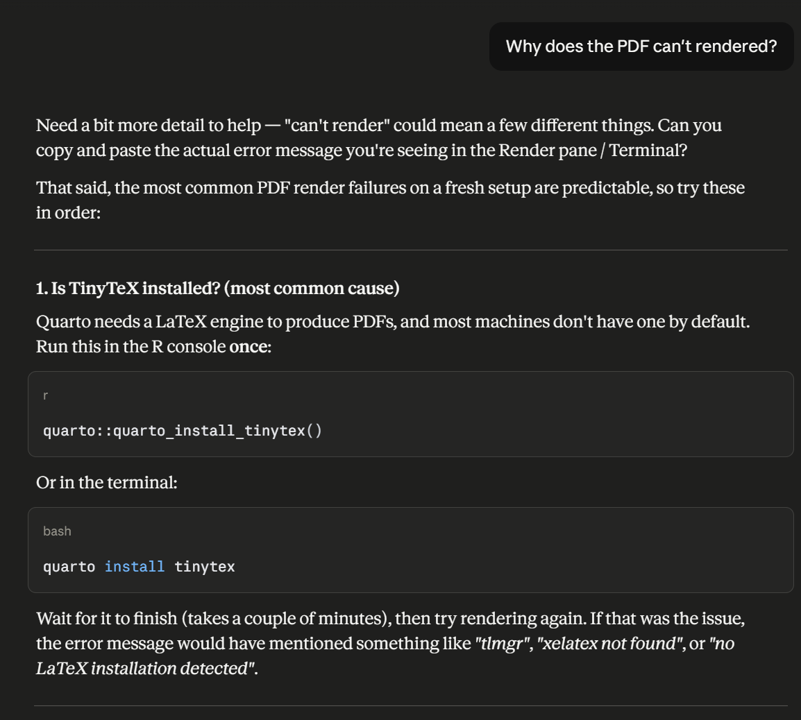
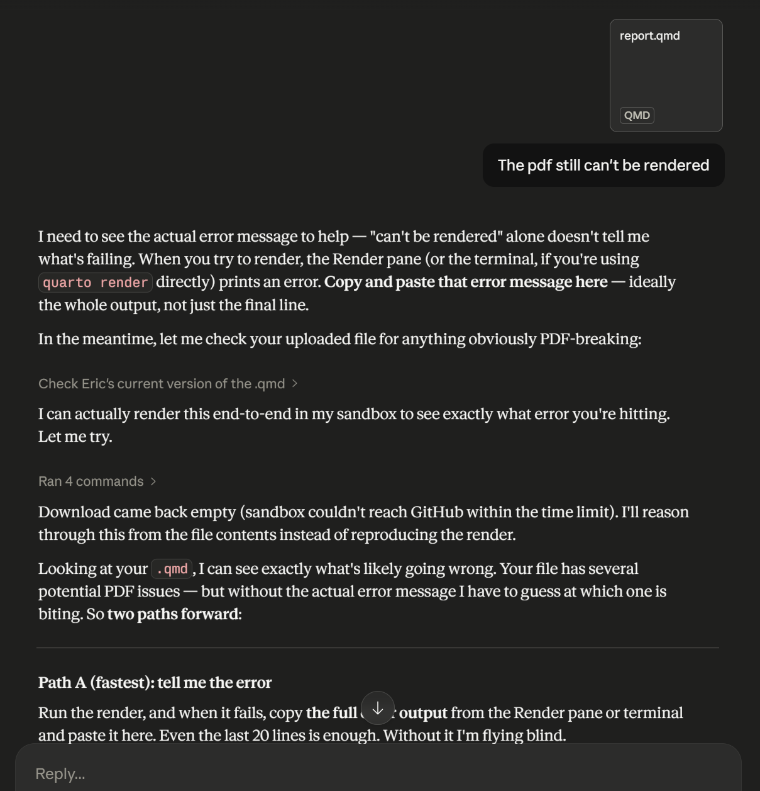
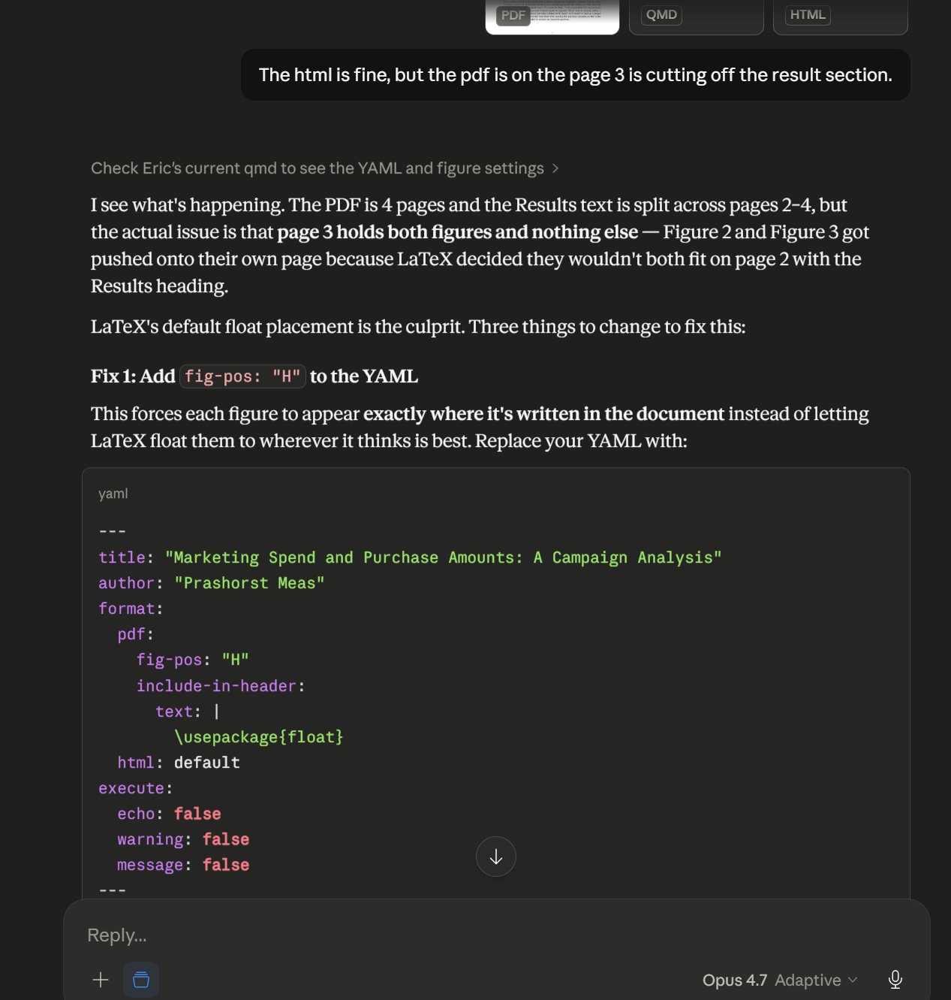
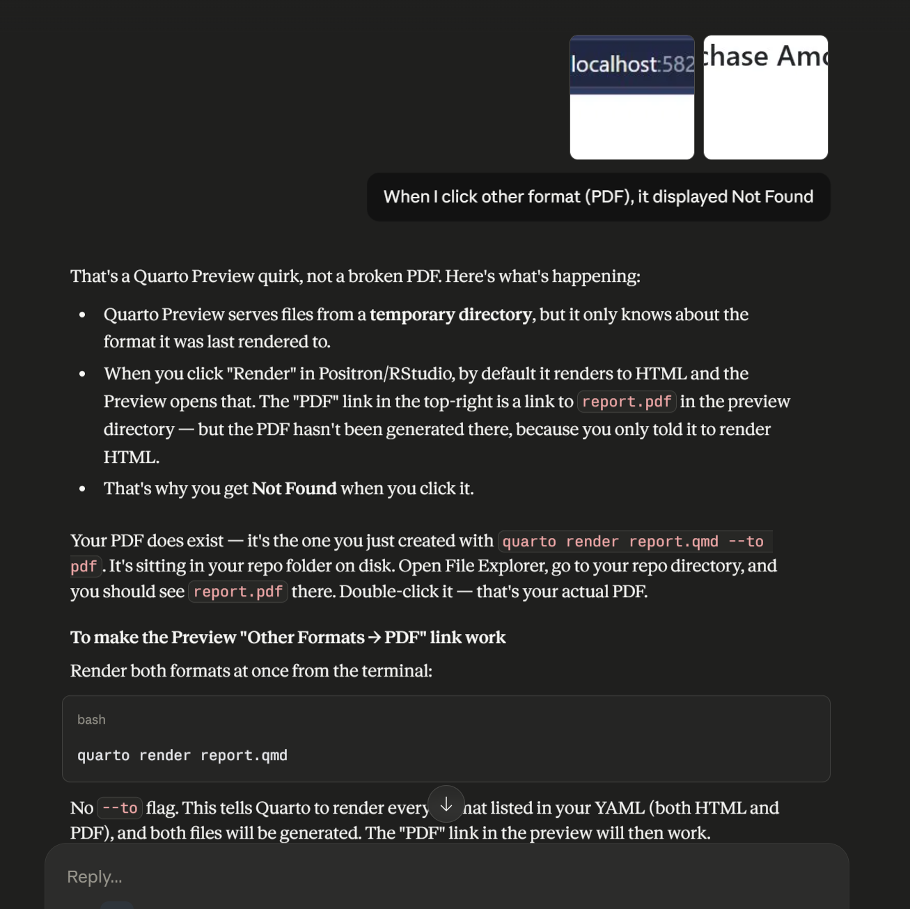
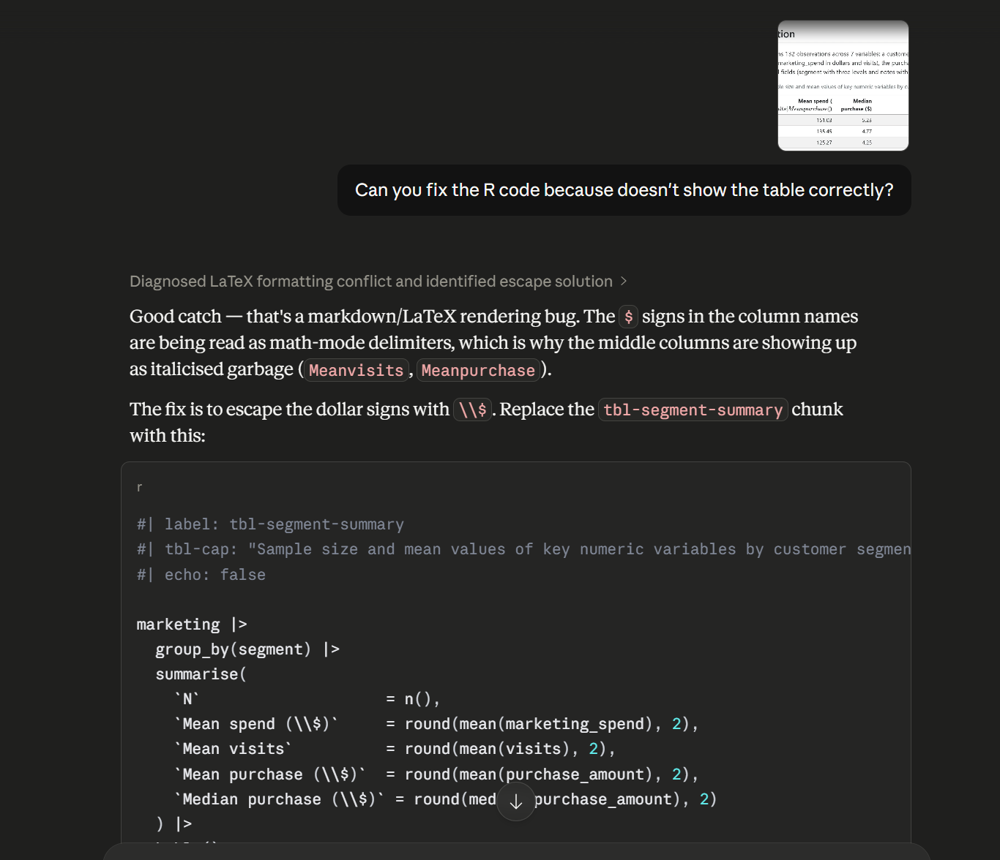
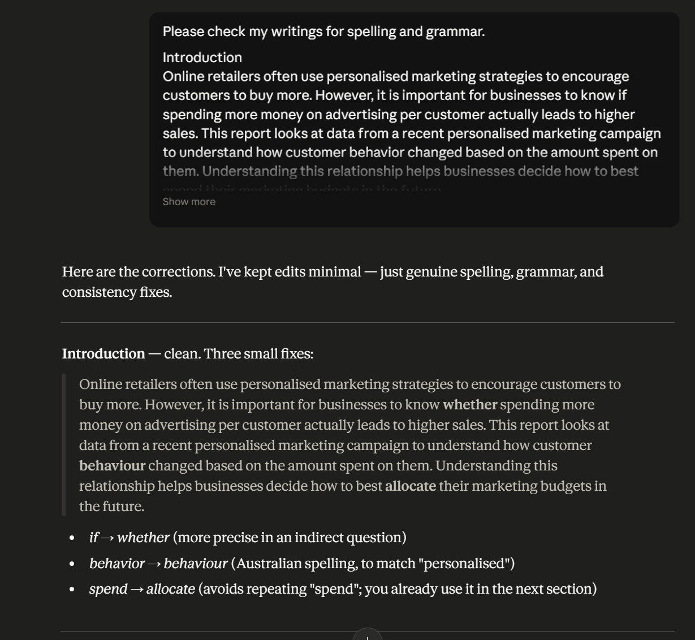
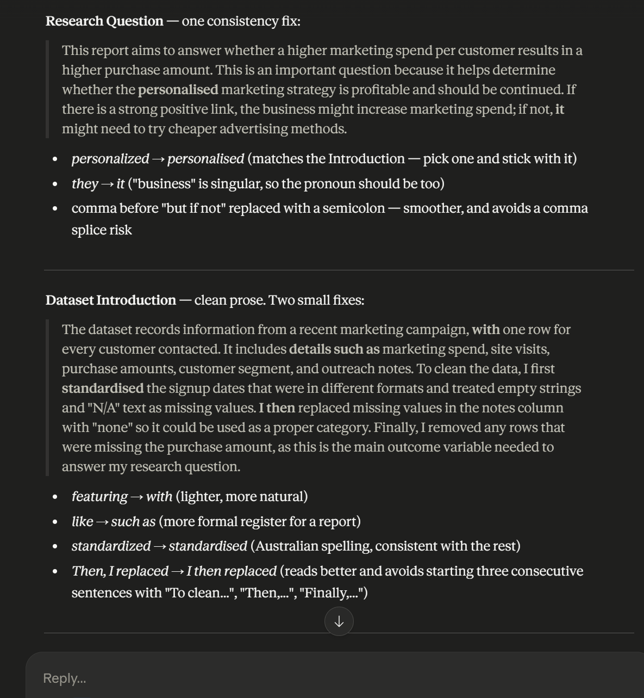
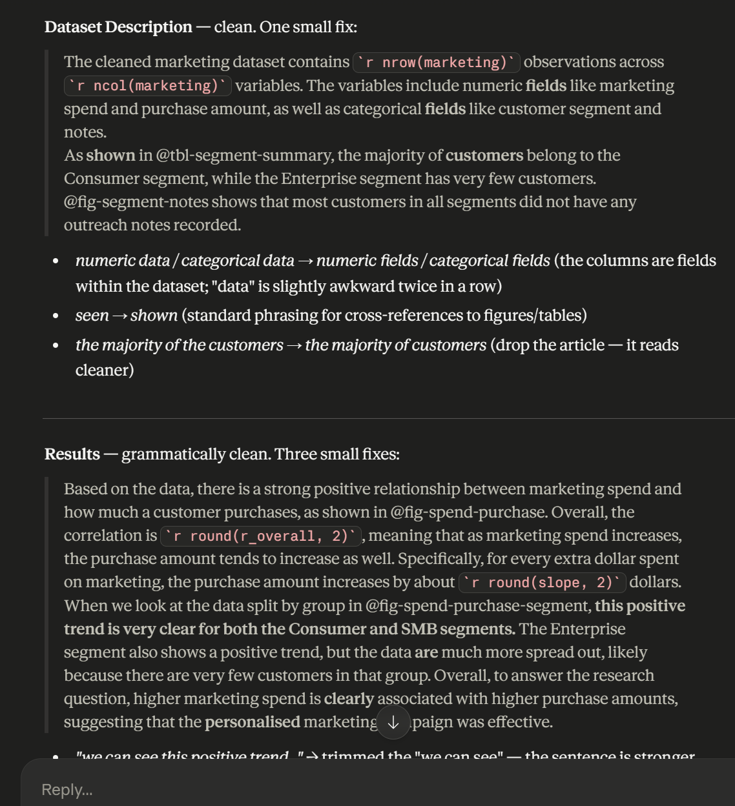
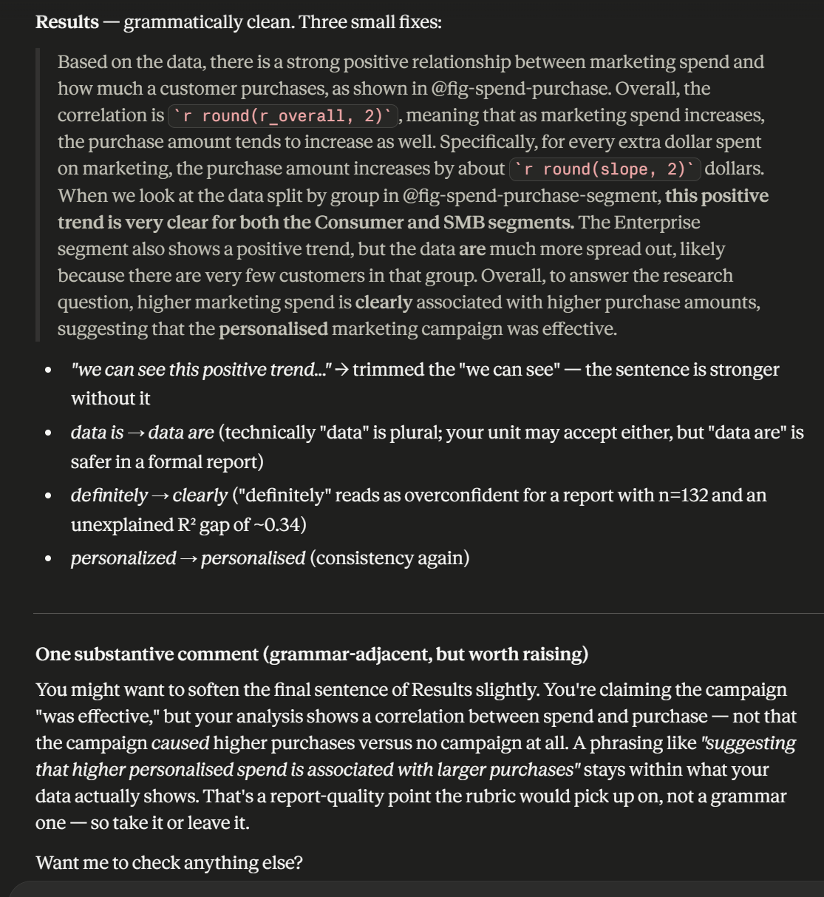

# Declaration of Generative AI Use

This assignment was completed with assistance from Claude (Anthropic)
in line with Monash University's policy on the responsible and ethical
use of generative AI technologies.

## Scope of AI use

AI was used for the following tasks during this assignment:

- Debugging: Diagnosing and fixing a LaTeX math-mode conflict in
  the summary table column headers (escaping `$` signs with `\\$`).
- PDF rendering troubleshooting: Identifying that Quarto Preview
  serves only the last-rendered format, and resolving figure
  placement issues in the PDF output using `fig-pos: "H"`.
- English proof-reading: Correcting grammar, spelling, and
  consistency across the Introduction, Research Question, Dataset,
  Dataset Description, and Results sections of my written prose.

## Work done independently

The following were completed by me without AI assistance:

- All prose content in the report (Introduction, Research Question,
  Dataset Introduction, Dataset Description commentary, Results
  paragraph), with AI providing only grammar and spelling corrections
  after I had written each section.
- The choice of research question framing, analytical approach, and
  interpretation of the statistical results.
- All Git and GitHub operations (clone, commit, push).

## Screenshots of AI interactions

The following screenshots document my interactions with Claude
relevant to this assignment.

